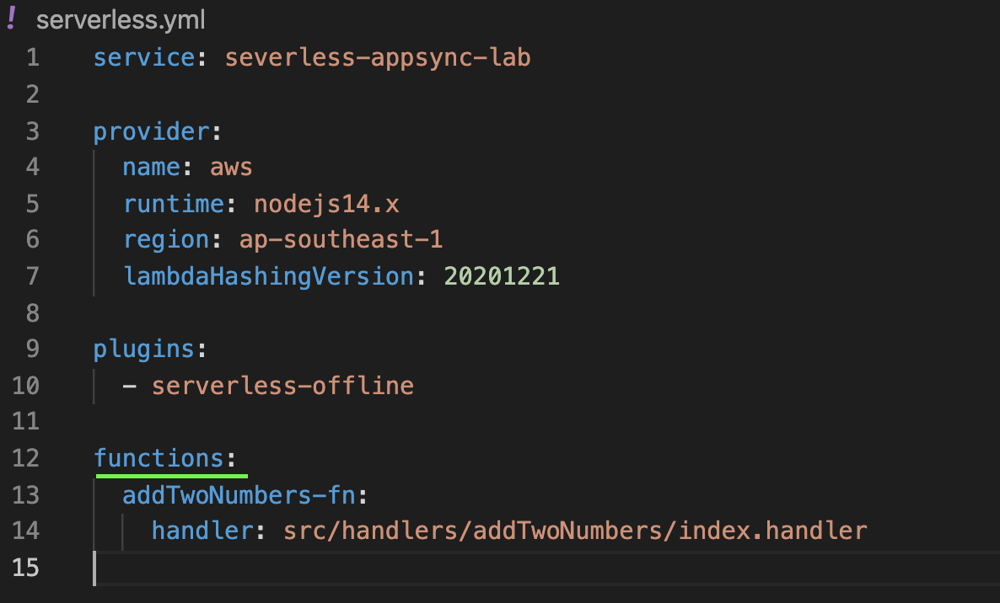

## Serverless AppSync Lab

This lab will immerse students about the components of [AWS AppSync](https://aws.amazon.com/appsync/) using [Serverless Framework.](https://www.serverless.com/)

**Prerequisites:**

- [NodeJS Version 14 or later](https://nodejs.org/en/)
- [Docker Desktop](https://www.docker.com/products/docker-desktop)

## 1. Understanding the serverless.yml file

_serverless.yml_ is a cloudformation-like template that compiles to vanilla cloudformation. It has some powerful transforms working with popular AWS serverless services like Lambda, API Gateway and DynamoDB. It and can also be extended via their rich [plugins ecosystem.](https://www.serverless.com/plugins)

**1a. Cloning and installing project dependencies**

Clone the project by issuing the command:

    git clone git@github.com:reppajm/serverless-appsync-lab.git

cd to the project directory:

    cd serverless-appsync-lab

Install npm packages:

    npm install

**1b. Working with Lambda Functions**

In the serverless.yml file, there is a section called **functions** as seen in the screenshot.

Notice the **_addTwoNumber-fn_** with a handler pointing to our code in the file system at **src/handlers/\*\*\***

Invoke the function by issuing the command:

    npx sls invoke local --function addTwoNumbers-fn --path src/handlers/addTwoNumbers/event.json

Edit the **event.json** file with the following values:

    {
        "first": 0,
        "second": 2
    }
